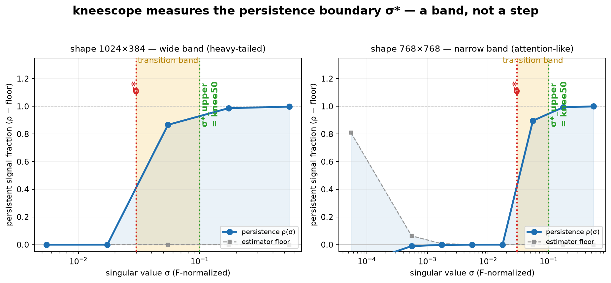
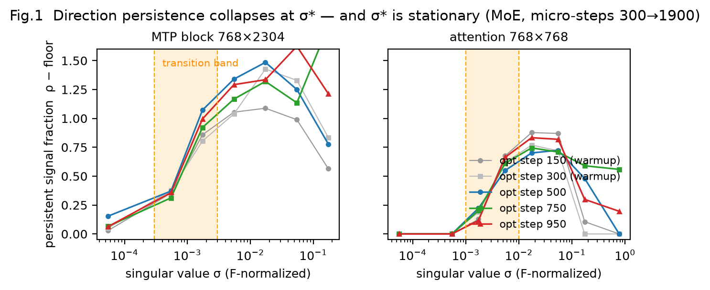
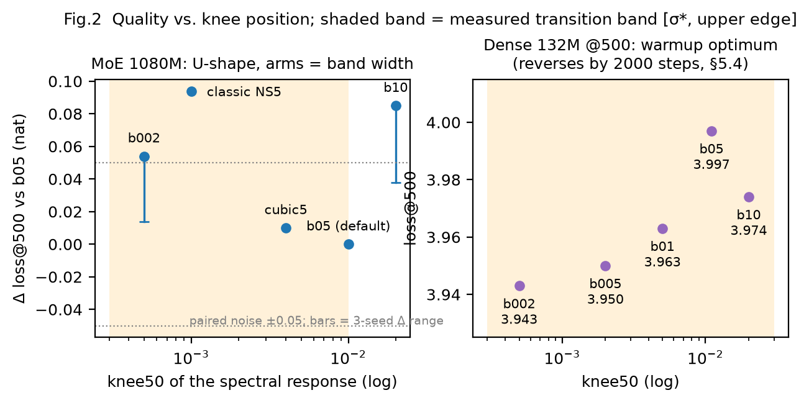
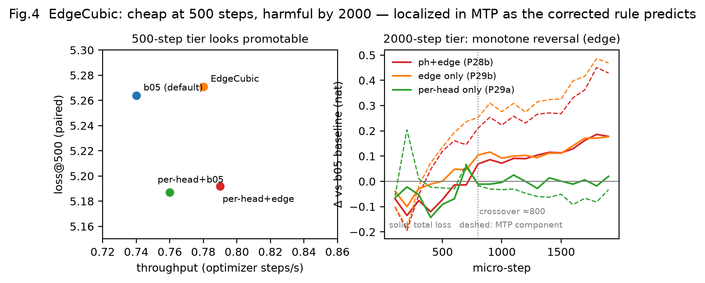
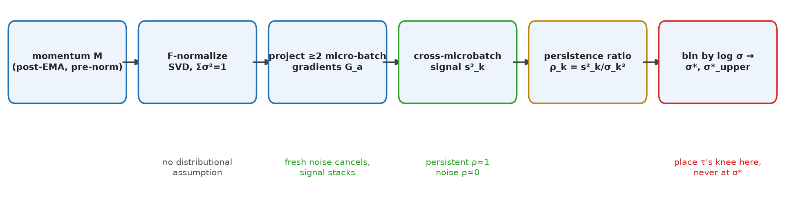
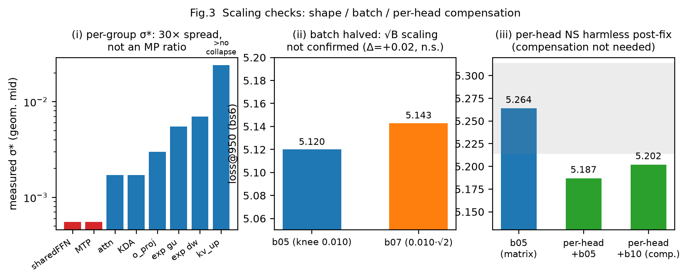

# kneescope

## Don't tune the knee. Measure it.

Muon-style optimizers whiten momentum with a Newton–Schulz iteration whose
spectral response has a **knee**: directions below it get suppressed, directions
above it get whitened. Where to place that knee has been a hand-tuned
hyperparameter — until now. **kneescope turns it into a measurement.**

It reads the *persistence boundary* — the threshold where momentum directions
carrying persistent gradient signal give way to fresh noise — and reports the
`[σ*, σ*_upper]` transition band, the one number you actually need to place the
whitening knee. And the companion paper shows the benchmark: **the quality-optimal
knee sits at the band's *upper* edge, not at σ*.** Putting it at σ* is a trap
that looks fine short-term and quietly destroys long-horizon training.

<p align="center">
  
  <br><em>The measurement, in one picture. The persistent-signal fraction ρ(σ) (blue) and its estimator floor (grey) are binned by log σ. Signal vanishes below the lower edge σ* (red). It is not recovered at σ* — it <b>climbs across a band</b>, reaching the upper edge σ*_upper (green), where a single-knee schedule should place <code>knee50</code>. Rendered directly by <code>kneescope.analyze()</code> on ground-truth data; two independent shape groups shown.</em>
</p>


---

## The headline results

These come from the companion paper, *"The Persistence Boundary"* (working draft
v3, 2026-08-25), measured on a real 1080M MoE (M4 Max, bf16) and validated on a
132M dense model.

**1. The textbook answer is wrong on real data.** Random-matrix theory says the
knee belongs at the Marchenko–Pastur bulk edge λ₊. It fails here: real momentum
spectra are smooth heavy-tailed (Zipf slopes −0.7…−2.7), entry noise is
anisotropic at ratios of 10²–10⁴, and spike peeling diverges. **Neither closed-form
scaling law survived** (knee ∝ (1/√m+1/√n), and knee ∝ √B both unconfirmed). The
whole *qualitative* frame — U-shape, knee = persistence boundary, zero weight below
σ* — did.

**2. There is a clean, assumption-free boundary.** Cross-microbatch direction
persistence ρ(σ) collapses sharply at a measurable boundary σ*, stationary across
micro-steps 300→1900. No random-matrix assumptions required. σ* is *not* monotone
in matrix size or aspect ratio: within-MoE variation (30×) is as large as the
cross-architecture shift.

<p align="center">
  
  <br><em>Fig. 1 from the companion paper. ρ(σ) collapses sharply at σ* and does not move across the probed window (micro-steps 300→1900); the shaded band is the measured transition region. This is what σ* <b>is</b> — a measurable collapse, not a fitted constant.</em>
</p>


**3. It's a band, not a step — and the optimum is at the top edge.** σ* is the
*lower* edge of a transition band whose persistent-signal fraction climbs ≈0.3→1.
The two arms of the U-shaped quality curve are exactly the band's width:

| knee placement | loss@500 vs. optimum |
|---|---|
| at σ* (lower edge) | **+0.054 nat** |
| **at σ*_upper (optimum)** | **peak** |
| past σ*_upper | **+0.085 nat** |

<p align="center">
  
  <br><em>Fig. 2 — the money picture. Left: on the 1080M MoE, Δloss@500 vs. knee50 is U-shaped, and the two arms land exactly on the shaded band's edges (paired floor ±0.05; bars are the 3-seed arm range). Right: the dense 132M model's five-point grid at the 500-step tier. Quality is <b>not</b> monotone in how accurately the spectral map is applied.</em>
</p>


**4. Replicates across architectures — with a horizon twist.** On a 132M dense
model σ* is ~10× lower than on the 1080M MoE, and the warmup-tier optimum moves
with it (five-point grid). But by **2000 steps the dense ranking reverses**: the
lowest knee destabilizes (NaN after a step-600 spike), the mid-band point concedes
0.07 nat, and the shared steady-state optimum sits at the band's *upper* edge
(knee50 ≈ 0.01) on **both** architectures. Under-whitening is paid upfront;
variance injection compounds.

**5. The naive reading fails — and that failure *proves* the law.** The
engineering shortcut "set each knee at its measured σ*" (EdgeCubic) is neutral at
500 steps (+0.007 nat, within the ±0.05 floor) at +5.4% throughput — it passed the
pre-registered bar. By 2000 steps it reverses monotonically: Δloss crosses zero at
step ≈800 and grows to **+0.18 nat**, with 4/5 of the regression in the auxiliary
MTP loss (**+0.47 nat**). The damage lands exactly in the groups the corrected law
flags (lowest σ*, widest band, heaviest tails). A law that calls its own naive
misreading's failure mode, in advance and in the right place, is doing work.

<p align="center">
  
  <br><em>Fig. 4 — the law's stress test. Left: the naive per-shape σ* rule (EdgeCubic) is quality-neutral at 500 steps and <b>faster</b> (+5.4% throughput), so a warmup gate promotes it. Right: by 2000 steps it reverses monotonically — Δloss crosses zero at step ≈800 and grows to +0.18 nat, with the MTP component (dashed) carrying most of the harm (+0.47 nat), localized exactly where the corrected law flags the widest bands.</em>
</p>


---

## What it measures

Muon-family optimizers orthogonalize the momentum matrix with a Newton–Schulz
iteration whose scalar spectral response has a *knee*: directions below the knee
are suppressed, directions above it are whitened. Placing that knee well requires
knowing which singular directions of the momentum matrix carry **persistent
gradient signal** and which carry only **fresh noise**. kneescope measures exactly
this, per shape group (matrices with the same `(rows, cols)` are pooled; there is
never one global number).

For each 2D momentum matrix `M` (the EMA-of-gradients matrix fed into the
orthogonalization, post-EMA/nesterov, pre-normalization) the estimator takes the
F-normalized SVD (`Σσ² = 1`) and projects ≥ 2 independent micro-batch gradients
`G_a` onto the singular directions: `d[a,k] = u_kᵀ G_a v_k`. The cross-microbatch
signal energy `s2_k = mean_{a<b} d[a,k]·d[b,k]` stacks persistent signal while
independent fresh noise averages to zero. The **persistence ratio** is
`ρ_k = s2_k / σ_k²`, with an estimator noise floor
`floor_k = max(Var_a(d_k) − s2_k, 0) / √n_pairs / σ_k²`. Persistent directions
have ρ ≈ 1; pure-noise directions have ρ ≈ 0. Per-direction values are binned by
log σ; per bin the tool reports the **median** ρ and **median** floor (the median
is essential — the floor blows up at tiny σ), and `excess = medianρ − medianfloor`.

σ* is the lower edge of the first bin (from low σ) whose excess ≥ 0.3, and
σ*_upper the lower edge of the first bin whose excess ≥ 0.9 (both thresholds
configurable). For a single-knee schedule the recommended `knee50` is **σ*_upper,
not σ***. An optional Marchenko–Pastur diagnostic (λ₊ spike peeling + bulk KS
check) is provided for comparison, but it is assumption-laden and known to fail on
heavy-tailed real spectra — the core estimator is assumption-free. This tool
accompanies the working draft *"The Persistence Boundary"* (companion paper),
which derives the theory and the scheduling consequences.

<p align="center">
  
  <br><em>What it measures, end to end. No distributional assumption enters: independent fresh noise cancels across micro-batches while persistent signal stacks, so ρ(σ) separates the two without a model.</em>
</p>


## Papers

The companion paper and its supporting research notes are bundled in
[`papers/`](papers/README.md):

- **The Persistence Boundary** (working draft v3, 2026-08-25) — markdown,
  LaTeX, compiled PDF, and fig1–fig4 under
  [`papers/the_persistence_boundary/`](papers/the_persistence_boundary/).
- Supporting research notes — spectral/RMT theory, the optimizer research
  program, and the experiment protocol under
  [`papers/references/`](papers/references/).

## Install

```bash
pip install -e .            # core: numpy only
pip install -e '.[torch]'   # PyTorch capture adapter
pip install -e '.[matplotlib]'  # plotting
pip install -e '.[mlx]'     # reserved for an MLX adapter (macOS only)
pip install -e '.[dev]'     # pytest + matplotlib, for running tests
```

## Quickstart (PyTorch)

```python
from kneescope.capture.torch import TorchKneeProbe
from kneescope import analyze

probe = TorchKneeProbe(model, steps={300, 600}, out_dir="knees", optimizer=opt)
probe.begin_microbatches(step)                     # before the micro-batch loop
with probe.capture_microbatch(loss): loss.backward()  # per micro-batch
probe.maybe_snapshot_momentum(step)                # right before opt.step()

result = analyze("knees")
print(result.text())
```

Only three lines touch the training loop. Capture is a no-op outside the listed
probe steps, so steady-state overhead is zero.

## Snapshot format

```
<snapdir>/
  manifest.json           # {"format_version": 1, "created_by": ..., "steps": [int],
                          #  "n_microbatches": int, "notes": {...}}
  mom_step{k}.npz         # one entry per parameter path: the 2D momentum matrix FED
                          # INTO the orthogonalization (post-EMA/nesterov,
                          # pre-normalization), stored float32
  grad_step{k}_mb{j}.npz  # same paths, micro-batch gradient j at its true
                          # per-microbatch scale (NOT divided by accumulation count)
```

npz keys are parameter paths such as `blocks.3.attn.wq.weight`. Stacked expert
tensors are split by the capturing adapter into individual 2D matrices with
synthesized paths such as `blocks.3.mlp.experts.gu[e37]`. Any tool can produce
this format; `kneescope.SnapshotWriter` is the reference writer and
`kneescope.load_snapshot(dir)` the validating reader.

## Reading the report

Per probed step and shape group you get the binned table (`σ` range, count,
median ρ, median floor, excess), then:

- **σ\*** — lower edge of the first bin with excess ≥ 0.30: persistent signal is
  essentially gone below this σ.
- **σ\*_upper** — lower edge of the first bin with excess ≥ 0.90: persistent
  signal dominates above this σ.
- **recommended knee50 = σ\*_upper** for a single-knee schedule.
- **noise anisotropy** (row/col second-moment ratios of the centered residual
  gradients, 1.0 = isotropic).
- optional **MP diagnostic**: λ̂₊ median, noise-energy share ŵ, spike count, and a
  KS shape check of the pooled bulk against the MP law.

> **WARNING — do NOT place the knee at σ\*** with a binary zero-below/flat-above
> rule. The companion paper (§8) shows this harms long-horizon training: σ\* is
> where signal *starts* to dominate, not where it is fully recovered. Place
> `knee50` at the **upper** band edge σ\*_upper (or use a smooth schedule across
> the band).

If no bin crosses a threshold — because signal persists at every visible σ or
never does — the group is reported as **"no collapse in view"** and no number is
invented. Likewise, if signal is already persistent at the lowest visible bin,
the boundary lies below the measurement window and is reported as such.

## Validation scope

The estimator and the band definitions were validated in one codebase at 132M and
1080M parameters, in bf16, over micro-steps 300–1900. The iid reading of the
chance floor is approximate under anisotropic noise — that is exactly why the
anisotropy diagnostic is printed alongside every group; distrust floor margins
when the row/col ratios depart strongly from 1. The MP diagnostic is validated
only on synthetic spiked spectra (where it recovers λ₊ to a few percent) and is
expected to mislead on heavy-tailed real momentum spectra.

<p align="center">
  
  <br><em>Fig. 3 — where the naive scaling laws break down. (i) Measured σ* spans ~30× across shape groups: it is a <b>per-shape-group</b> number, not an MP ratio. (ii) Halving the effective batch does <b>not</b> confirm the √B knee law. (iii) Per-head reshaping is harmless post-fix — per-group measurement replaces the MP-motivated compensation.</em>
</p>


## License

MIT. See `LICENSE`.
